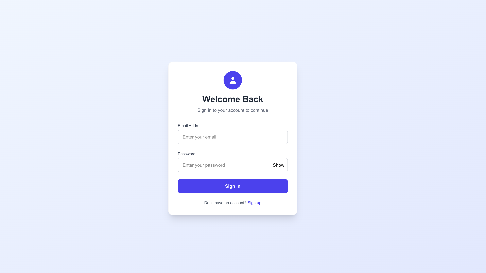
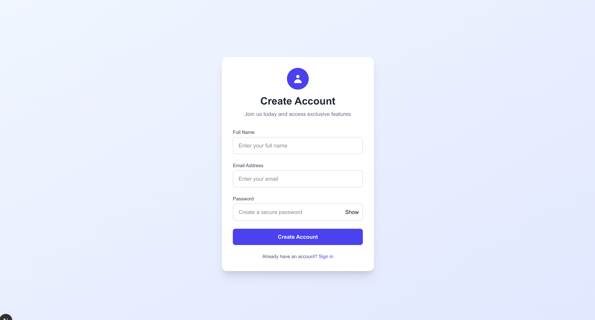
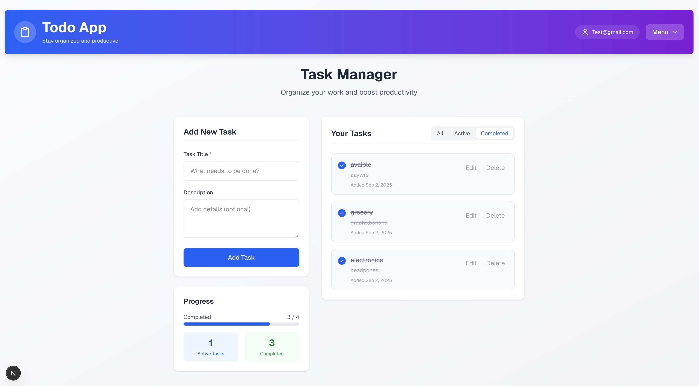

# Task Management App (Client)

This is the **frontend client** for the Task Management App, built with **Next.js**.  
It connects to a **Laravel API backend** to provide user authentication and task management features.

## ✅ Features

- **User Authentication**

  - Register and login
  - Logout
  - Protected routes for authenticated users

- **Task Management**
  - Create new tasks with a **title** and **description**
  - Mark tasks as **complete** or **incomplete**
  - Edit tasks
  - Delete tasks
  - View all tasks for the logged-in user

## 🚀 Getting Started

### Prerequisites

- Node.js (v18 or higher)
- npm, yarn
- Laravel API backend running (see backend repository for setup)

### Installation

1. **Clone the repository**

```bash
   git clone https://github.com/kashif451/todo-client-side.git
   cd todo-client-side
```

## Install dependencies

```bash
npm install
```

## Environment Setup

Create a .env.local file in the root directory and add the following:

```bash
NEXT_PUBLIC_API_URL=http://127.0.0.1:8000/api
```

## Run the development server

```bash
npm run dev
```

## Open your browser

Navigate to http://localhost:3000 to view the application.


## Screenshots

### Login Page


### Register


### Task lists

